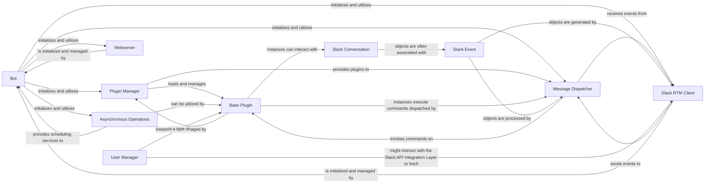

## Details

Abstract Components Overview

### Bot

The central orchestrator of the Slackminion bot framework. It initializes and manages core services like plugin management, message dispatching, asynchronous task scheduling, and integration with Slack's RTM API and a web server. It represents the "Core Bot Logic."

**Related Classes/Methods**:

- <a href="https://github.com/pinterest/slackminion/blob/master/slackminion/bot.py#L23-L400" target="_blank" rel="noopener noreferrer">`slackminion.bot.Bot` (23:400)</a>

### Plugin Manager

Responsible for loading, managing, and interacting with various plugins. It ensures the extensibility and modularity of the bot by handling the lifecycle of plugins, embodying the "Plugin Management System" aspect.

**Related Classes/Methods**:

- <a href="https://github.com/pinterest/slackminion/blob/master/slackminion/plugin/manager.py#L12-L164" target="_blank" rel="noopener noreferrer">`slackminion.plugin.manager.PluginManager` (12:164)</a>

### Message Dispatcher

Processes incoming messages and events from Slack, identifies commands, and dispatches them to the appropriate plugin handlers. It acts as the central routing mechanism for bot commands, aligning with the "Event Dispatcher" and "Command Pattern."

**Related Classes/Methods**:

- <a href="https://github.com/pinterest/slackminion/blob/master/slackminion/dispatcher.py#L61-L232" target="_blank" rel="noopener noreferrer">`slackminion.dispatcher.MessageDispatcher` (61:232)</a>

### Asynchronous Operations [[Expand]](./Asynchronous_Operations.md)

Manages and schedules asynchronous operations, including periodic tasks and delayed calls, to ensure the bot's non-blocking execution and responsiveness. It provides a robust mechanism for executing tasks in the background without impeding the main bot thread's ability to process real-time events.

**Related Classes/Methods**:

- <a href="https://github.com/pinterest/slackminion/blob/master/slackminion/utils/async_task.py#L70-L232" target="_blank" rel="noopener noreferrer">`slackminion.utils.async_task.AsyncTaskManager` (70:232)</a>

### Slack RTM Client

Establishes and maintains a Real-Time Messaging (RTM) connection with the Slack API, receiving real-time events and messages that the bot needs to process. This forms the core of the "Slack API Integration Layer."

**Related Classes/Methods**:

- <a href="https://github.com/pinterest/slackminion/blob/master/slackminion/slack/rtm_client.py#L3-L11" target="_blank" rel="noopener noreferrer">`slackminion.slack.rtm_client.MyRTMClient` (3:11)</a>

### Webserver

Provides an HTTP interface for the bot, enabling it to receive webhooks or serve web-based functionalities. It's crucial for handling external integrations or custom web UIs, representing the "Web Server" component.

**Related Classes/Methods**:

- <a href="https://github.com/pinterest/slackminion/blob/master/slackminion/webserver.py#L9-L55" target="_blank" rel="noopener noreferrer">`slackminion.webserver.Webserver` (9:55)</a>

### Base Plugin

The foundational class for all bot plugins, providing common functionalities and an interface for interaction with the bot's core services. Plugins extend this class to add specific features, central to the "Plugin Architecture."

**Related Classes/Methods**:

- <a href="https://github.com/pinterest/slackminion/blob/master/slackminion/plugin/base.py#L11-L189" target="_blank" rel="noopener noreferrer">`slackminion.plugin.base.BasePlugin` (11:189)</a>

### Slack Event

Represents various types of events received from the Slack API (e.g., messages, user changes, channel updates). These objects encapsulate the data associated with each event, crucial for the "Event-Driven Architecture."

**Related Classes/Methods**:

- <a href="https://github.com/pinterest/slackminion/blob/master/slackminion/slack/event.py#L1-L47" target="_blank" rel="noopener noreferrer">`slackminion.slack.event.SlackEvent` (1:47)</a>

### Slack Conversation

Represents a Slack conversation, which can be a channel, a direct message (IM), or a multi-person direct message (MPDM). It provides methods for interacting with these conversation types, essential for the bot's communication capabilities.

**Related Classes/Methods**:

- <a href="https://github.com/pinterest/slackminion/blob/master/slackminion/slack/conversation.py#L3-L73" target="_blank" rel="noopener noreferrer">`slackminion.slack.conversation.SlackConversation` (3:73)</a>

### User Manager

A core plugin responsible for managing user-related information, potentially including authentication, authorization, and user profiles within the bot's context. This is a key part of the "Configuration Management" and potentially "Dependency Injection" aspects.

**Related Classes/Methods**:

- <a href="https://github.com/pinterest/slackminion/blob/master/slackminion/plugins/core/user.py#L8-L65" target="_blank" rel="noopener noreferrer">`slackminion.plugins.core.user.UserManager` (8:65)</a>

### [FAQ](https://github.com/CodeBoarding/GeneratedOnBoardings/tree/main?tab=readme-ov-file#faq)