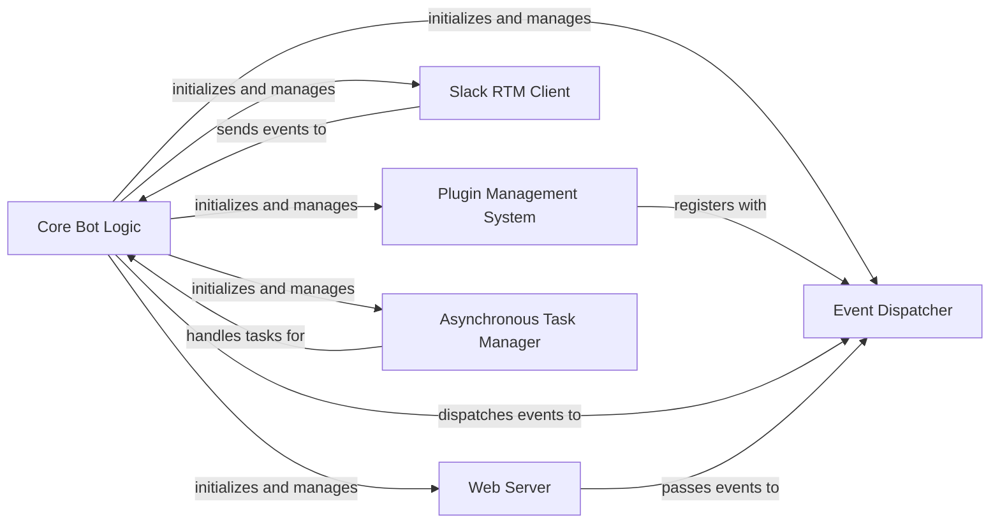

## Details

One paragraph explaining the functionality which is represented by this graph. What the main flow is and what is its purpose.

### Core Bot Logic

The central orchestrator of the Slackminion bot. It initializes and manages all other core components, including the Plugin Manager, Message Dispatcher, Slack RTM Client, Webserver, and Asynchronous Task Manager. It's responsible for the bot's overall lifecycle, handling startup, shutdown, and configuration. It processes raw Slack events and prepares output messages.

**Related Classes/Methods**:

- <a href="https://github.com/pinterest/slackminion/blob/master/slackminion/bot.py#L23-L400" target="_blank" rel="noopener noreferrer">`slackminion.bot.Bot` (23:400)</a>

- <a href="https://github.com/pinterest/slackminion/blob/master/slackminion/__main__.py#L11-L76" target="_blank" rel="noopener noreferrer">`slackminion.__main__.main` (11:76)</a>

### Plugin Management System

Manages the discovery, loading, unloading, and lifecycle of plugins. It scans for available plugins, instantiates them, and registers their commands and event handlers with the Event Dispatcher, making them available to the bot.

**Related Classes/Methods**:

- <a href="https://github.com/pinterest/slackminion/blob/master/slackminion/plugin/manager.py#L1-L1" target="_blank" rel="noopener noreferrer">`slackminion.plugin.manager` (1:1)</a>

### Event Dispatcher

The core of the bot's "Event-Driven Architecture." It receives incoming messages and events (from Slack via the RTM Client or from webhooks via the Web Server) and dispatches them to the appropriate registered command handlers or event listeners within the loaded plugins.

**Related Classes/Methods**:

- <a href="https://github.com/pinterest/slackminion/blob/master/slackminion/dispatcher.py#L1-L1" target="_blank" rel="noopener noreferrer">`slackminion.dispatcher` (1:1)</a>

### Slack RTM Client

Handles the real-time messaging (RTM) connection to the Slack API. It establishes and maintains the WebSocket connection, sends messages to Slack, and receives real-time events (e.g., messages, user presence changes) from Slack.

**Related Classes/Methods**:

- <a href="https://github.com/pinterest/slackminion/blob/master/slackminion/slack/rtm_client.py#L1-L1" target="_blank" rel="noopener noreferrer">`slackminion.slack.rtm_client` (1:1)</a>

### Web Server

Provides an HTTP interface for the bot, built using Flask. It enables functionalities like webhook commands (allowing external services to trigger bot actions) and potentially serving status pages or other web-based interactions.

**Related Classes/Methods**:

- <a href="https://github.com/pinterest/slackminion/blob/master/slackminion/webserver.py#L1-L1" target="_blank" rel="noopener noreferrer">`slackminion.webserver` (1:1)</a>

### Asynchronous Task Manager

Manages asynchronous tasks, allowing the bot to perform non-blocking operations and handle long-running processes (e.g., network requests, complex computations) without freezing the main event loop.

**Related Classes/Methods**:

- <a href="https://github.com/pinterest/slackminion/blob/master/slackminion/utils/async_task.py#L1-L1" target="_blank" rel="noopener noreferrer">`slackminion.utils.async_task` (1:1)</a>

### [FAQ](https://github.com/CodeBoarding/GeneratedOnBoardings/tree/main?tab=readme-ov-file#faq)