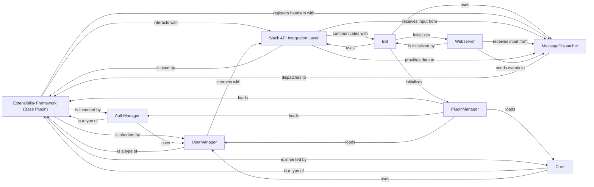

## Details

The `Extensibility Framework` subsystem is central to the `slackminion` bot, embodying its modular and extensible design. It defines the foundational structure for all bot functionalities, allowing for dynamic addition and management of features.

### Extensibility Framework (Base Plugin)

This is the abstract interface (`slackminion.plugin.base.BasePlugin`) that all concrete plugins must inherit from. It establishes a standardized contract for plugin development, ensuring consistent interaction with the bot's core services (e.g., command registration, event handling, message sending).

**Related Classes/Methods**:

- <a href="https://github.com/pinterest/slackminion/blob/master/slackminion/plugin/base.py#L11-L189" target="_blank" rel="noopener noreferrer">`slackminion.plugin.base.BasePlugin` (11:189)</a>

### PluginManager

Responsible for discovering, loading, initializing, and managing the lifecycle of all plugins. It ensures that plugins are properly integrated into the bot's runtime environment and can be dynamically enabled or disabled.

**Related Classes/Methods**:

- `PluginManager`

### Bot

The central application class that orchestrates the entire bot's operations. It initializes core services, loads plugins via the `PluginManager`, and coordinates interactions between various components, including message processing and API communication.

**Related Classes/Methods**:

- <a href="https://github.com/pinterest/slackminion/blob/master/slackminion/bot.py#L23-L400" target="_blank" rel="noopener noreferrer">`Bot` (23:400)</a>

### MessageDispatcher

Handles incoming messages and events from the chat platform (e.g., Slack). It parses these inputs and routes them to the appropriate command handlers or event listeners registered by the loaded plugins.

**Related Classes/Methods**:

- `MessageDispatcher`

### AuthManager

A built-in plugin (`slackminion.plugins.core.acl.AuthManager`) that provides essential security by managing user permissions and access control. It defines who can execute specific commands or access certain bot features.

**Related Classes/Methods**:

- <a href="https://github.com/pinterest/slackminion/blob/master/slackminion/plugins/core/acl.py#L33-L209" target="_blank" rel="noopener noreferrer">`slackminion.plugins.core.acl.AuthManager` (33:209)</a>

### Core [[Expand]](./Core.md)

A built-in plugin (`slackminion.plugins.core.core.Core`) that offers fundamental bot commands (e.g., `help`, `save`, `shutdown`). These commands are vital for basic bot operation and administration.

**Related Classes/Methods**:

- <a href="https://github.com/pinterest/slackminion/blob/master/slackminion/plugins/core/core.py#L15-L150" target="_blank" rel="noopener noreferrer">`slackminion.plugins.core.core.Core` (15:150)</a>

### UserManager

A built-in plugin (`slackminion.plugins.core.user.UserManager`) responsible for managing user-related data and interactions within the bot. This might include user profiles, settings, or other user-specific information.

**Related Classes/Methods**:

- <a href="https://github.com/pinterest/slackminion/blob/master/slackminion/plugins/core/user.py#L8-L65" target="_blank" rel="noopener noreferrer">`slackminion.plugins.core.user.UserManager` (8:65)</a>

### Slack API Integration Layer

This component comprises various modules and classes (`slackminion.slack.*`, e.g., `slackminion.slack.event.SlackEvent`, `slackminion.slack.user.SlackUser`, `slackminion.slack.rtm_client.MyRTMClient`) that abstract the complexities of interacting with the Slack API. It handles sending messages, receiving events, and managing Slack-specific data objects.

**Related Classes/Methods**:

- <a href="https://github.com/pinterest/slackminion/blob/master/slackminion/slack/event.py" target="_blank" rel="noopener noreferrer">`slackminion.slack.event.SlackEvent`</a>

- <a href="https://github.com/pinterest/slackminion/blob/master/slackminion/slack/user.py#L3-L77" target="_blank" rel="noopener noreferrer">`slackminion.slack.user.SlackUser` (3:77)</a>

- <a href="https://github.com/pinterest/slackminion/blob/master/slackminion/slack/rtm_client.py#L3-L11" target="_blank" rel="noopener noreferrer">`slackminion.slack.rtm_client.MyRTMClient` (3:11)</a>

### Webserver

Provides HTTP endpoints for handling webhooks (e.g., Slack interactive components, slash commands) and potentially serving a web-based interface for bot administration or external integrations.

**Related Classes/Methods**:

- <a href="https://github.com/pinterest/slackminion/blob/master/slackminion/webserver.py#L9-L55" target="_blank" rel="noopener noreferrer">`Webserver` (9:55)</a>

### [FAQ](https://github.com/CodeBoarding/GeneratedOnBoardings/tree/main?tab=readme-ov-file#faq)