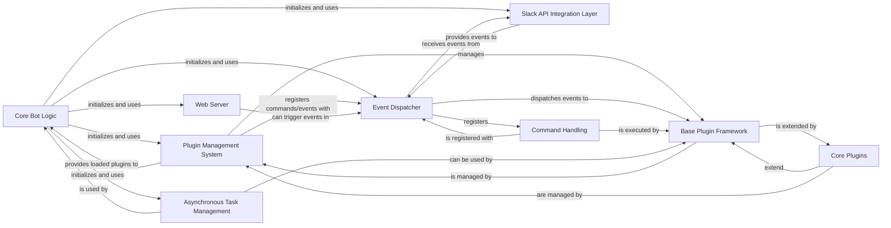

## Details

Abstract Components Overview

### Core Bot Logic

The central orchestrator of the bot framework. It initializes and coordinates all other major components, including the Plugin Manager, Event Dispatcher, Slack RTM Client, and Web Server. It's responsible for the overall lifecycle of the bot.

**Related Classes/Methods**:

- <a href="https://github.com/pinterest/slackminion/blob/master/slackminion/bot.py#L23-L400" target="_blank" rel="noopener noreferrer">`slackminion.bot.Bot` (23:400)</a>

### Plugin Management System

Discovers, loads, unloads, and manages the lifecycle of all bot plugins. It ensures plugins are properly initialized and their commands and event handlers are registered with the Event Dispatcher. It's crucial for the bot's extensibility.

**Related Classes/Methods**:

- <a href="https://github.com/pinterest/slackminion/blob/master/slackminion/plugin/manager.py#L12-L164" target="_blank" rel="noopener noreferrer">`slackminion.plugin.manager.PluginManager` (12:164)</a>

### Base Plugin Framework

Provides the foundational structure and interface for all plugins. Plugins inherit from this class to define their commands, event handlers, and other functionalities, ensuring a consistent API for the Plugin Management System.

**Related Classes/Methods**:

- <a href="https://github.com/pinterest/slackminion/blob/master/slackminion/plugin/base.py#L11-L189" target="_blank" rel="noopener noreferrer">`slackminion.plugin.base.BasePlugin` (11:189)</a>

### Event Dispatcher

Responsible for routing incoming events (e.g., Slack messages, RTM events) to the appropriate registered handlers within plugins. It acts as a central hub for event-driven communication within the bot.

**Related Classes/Methods**:

- <a href="https://github.com/pinterest/slackminion/blob/master/slackminion/dispatcher.py#L61-L232" target="_blank" rel="noopener noreferrer">`slackminion.dispatcher.MessageDispatcher` (61:232)</a>

### Slack API Integration Layer

Handles all communication with the Slack API, including receiving real-time messages (RTM), sending messages, managing conversations, and user information. It abstracts the complexities of the Slack API for the rest of the bot.

**Related Classes/Methods**:

- <a href="https://github.com/pinterest/slackminion/blob/master/slackminion/slack/rtm_client.py#L3-L11" target="_blank" rel="noopener noreferrer">`slackminion.slack.rtm_client.MyRTMClient` (3:11)</a>

- <a href="https://github.com/pinterest/slackminion/blob/master/slackminion/slack/conversation.py#L1-L9999" target="_blank" rel="noopener noreferrer">`slackminion.slack.conversation` (1:9999)</a>

- <a href="https://github.com/pinterest/slackminion/blob/master/slackminion/slack/user.py#L1-L9999" target="_blank" rel="noopener noreferrer">`slackminion.slack.user` (1:9999)</a>

- <a href="https://github.com/pinterest/slackminion/blob/master/slackminion/slack/event.py#L1-L9999" target="_blank" rel="noopener noreferrer">`slackminion.slack.event` (1:9999)</a>

### Command Handling

Defines the structure and behavior of commands that plugins can expose. This includes parsing command arguments and executing the corresponding plugin logic. It supports both direct plugin commands and webhook-triggered commands.

**Related Classes/Methods**:

- <a href="https://github.com/pinterest/slackminion/blob/master/slackminion/dispatcher.py#L61-L232" target="_blank" rel="noopener noreferrer">`slackminion.dispatcher.MessageDispatcher` (61:232)</a>

### Web Server

Provides an HTTP server for handling incoming webhooks, API calls, or other web-based interactions. It allows external services to communicate with the bot.

**Related Classes/Methods**:

- <a href="https://github.com/pinterest/slackminion/blob/master/slackminion/webserver.py#L9-L55" target="_blank" rel="noopener noreferrer">`slackminion.webserver.Webserver` (9:55)</a>

### Core Plugins

A set of essential, built-in plugins that provide fundamental bot functionalities such as user management, ACL (Access Control List), and basic bot commands. These are standard BasePlugin implementations.

**Related Classes/Methods**:

- <a href="https://github.com/pinterest/slackminion/blob/master/slackminion/plugins/core/core.py#L1-L9999" target="_blank" rel="noopener noreferrer">`slackminion.plugins.core.core` (1:9999)</a>

- <a href="https://github.com/pinterest/slackminion/blob/master/slackminion/plugins/core/acl.py#L1-L9999" target="_blank" rel="noopener noreferrer">`slackminion.plugins.core.acl` (1:9999)</a>

- <a href="https://github.com/pinterest/slackminion/blob/master/slackminion/plugins/core/user.py#L1-L9999" target="_blank" rel="noopener noreferrer">`slackminion.plugins.core.user` (1:9999)</a>

### Asynchronous Task Management

Manages background and scheduled tasks, allowing plugins and the core bot logic to perform operations asynchronously without blocking the main event loop.

**Related Classes/Methods**:

- <a href="https://github.com/pinterest/slackminion/blob/master/slackminion/utils/async_task.py#L1-L9999" target="_blank" rel="noopener noreferrer">`slackminion.utils.async_task` (1:9999)</a>

### [FAQ](https://github.com/CodeBoarding/GeneratedOnBoardings/tree/main?tab=readme-ov-file#faq)