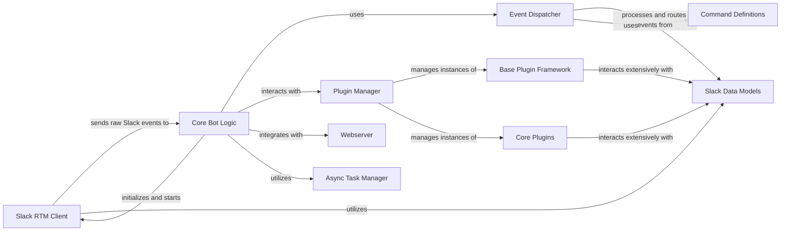

## Details

The `Slack Communication` subsystem is crucial for `slackminion` as it directly handles the interaction with the Slack platform. It's designed to manage the real-time messaging (RTM) connection, process incoming events, and facilitate sending messages. This aligns perfectly with the project's "Bot Framework" type and "Event-Driven Architecture" pattern.

### Slack RTM Client

This component is the primary interface for real-time communication with Slack. It establishes and maintains the WebSocket connection, handling the low-level details of sending messages to Slack and receiving real-time events (e.g., messages, user presence changes). It abstracts away the complexities of the WebSocket protocol, providing a simplified interface for the bot to interact with Slack's RTM API.

**Related Classes/Methods**:

- <a href="https://github.com/pinterest/slackminion/blob/master/slackminion/slack/rtm_client.py#L3-L11" target="_blank" rel="noopener noreferrer">`slackminion.slack.rtm_client.MyRTMClient` (3:11)</a>

### Slack Data Models

This component provides a set of structured Python objects that represent various Slack entities such as events, conversations (channels, direct messages), and users. These models abstract the raw, often complex, JSON data received from the Slack API into more usable and type-safe forms. This abstraction simplifies interaction with Slack data throughout the bot framework, making it easier for other components and plugins to process and manipulate Slack-related information.

**Related Classes/Methods**:

- <a href="https://github.com/pinterest/slackminion/blob/master/slackminion/slack/event.py#L1-L1" target="_blank" rel="noopener noreferrer">`slackminion.slack.event.SlackEvent` (1:1)</a>

- <a href="https://github.com/pinterest/slackminion/blob/master/slackminion/slack/conversation.py#L3-L73" target="_blank" rel="noopener noreferrer">`slackminion.slack.conversation.SlackConversation` (3:73)</a>

- <a href="https://github.com/pinterest/slackminion/blob/master/slackminion/slack/user.py#L3-L77" target="_blank" rel="noopener noreferrer">`slackminion.slack.user.SlackUser` (3:77)</a>

### Core Bot Logic

This component represents the central orchestrator of the bot framework. It initializes and starts the Slack RTM Client, receives raw Slack events from it, and then dispatches these events to the appropriate handlers (e.g., plugins). It acts as the brain of the bot, coordinating interactions between various components and ensuring the smooth flow of operations.

**Related Classes/Methods**:

- <a href="https://github.com/pinterest/slackminion/blob/master/slackminion/bot.py#L23-L400" target="_blank" rel="noopener noreferrer">`slackminion.bot.Bot` (23:400)</a>

### Event Dispatcher

This component is responsible for processing and routing events received from the Slack RTM Client. It takes the raw Slack events, which are represented by objects from the Slack Data Models, and directs them to the relevant plugins or internal handlers based on predefined rules or event types. This component is fundamental to the "Event-Driven Architecture" of the bot, enabling modular and decoupled event handling.

**Related Classes/Methods**:

- <a href="https://github.com/pinterest/slackminion/blob/master/slackminion/dispatcher.py#L61-L232" target="_blank" rel="noopener noreferrer">`slackminion.dispatcher.MessageDispatcher` (61:232)</a>

### Plugin Manager

This component manages the loading, unloading, and lifecycle of plugins within the bot framework. It ensures that plugins are properly initialized and registered, and it provides an interface for the Core Bot Logic to interact with the loaded plugins. This component is central to the "Plugin Architecture" of the project, enabling extensibility and modularity.

**Related Classes/Methods**:

- <a href="https://github.com/pinterest/slackminion/blob/master/slackminion/plugin/manager.py#L12-L164" target="_blank" rel="noopener noreferrer">`slackminion.plugin.manager.PluginManager` (12:164)</a>

### Base Plugin Framework

This component provides the foundational structure and common functionalities for all plugins. It defines the interface and base classes that plugins must adhere to, ensuring consistency and simplifying plugin development. Plugins interact extensively with Slack Data Models through this framework.

**Related Classes/Methods**:

- <a href="https://github.com/pinterest/slackminion/blob/master/slackminion/plugin/base.py#L11-L189" target="_blank" rel="noopener noreferrer">`slackminion.plugin.base.BasePlugin` (11:189)</a>

### Core Plugins

These are essential plugins that provide fundamental functionalities to the bot, such as user management, access control, and basic bot commands. They are built upon the Base Plugin Framework and interact extensively with Slack Data Models to perform their operations.

**Related Classes/Methods**:

- <a href="https://github.com/pinterest/slackminion/blob/master/slackminion/plugins/core/acl.py#L33-L209" target="_blank" rel="noopener noreferrer">`slackminion.plugins.core.acl.AuthManager` (33:209)</a>

- <a href="https://github.com/pinterest/slackminion/blob/master/slackminion/plugins/core/core.py#L15-L150" target="_blank" rel="noopener noreferrer">`slackminion.plugins.core.core.Core` (15:150)</a>

- <a href="https://github.com/pinterest/slackminion/blob/master/slackminion/plugins/core/user.py#L8-L65" target="_blank" rel="noopener noreferrer">`slackminion.plugins.core.user.UserManager` (8:65)</a>

### Webserver

This component provides a web interface for the bot, potentially for administrative tasks, webhook handling, or exposing certain bot functionalities via HTTP. It integrates with the Core Bot Logic to receive and process web requests.

**Related Classes/Methods**:

- <a href="https://github.com/pinterest/slackminion/blob/master/slackminion/webserver.py#L9-L55" target="_blank" rel="noopener noreferrer">`slackminion.webserver.Webserver` (9:55)</a>

### Async Task Manager

This component handles asynchronous tasks, allowing the bot to perform non-blocking operations and manage background processes efficiently. It integrates with the Core Bot Logic to execute tasks without hindering the main event loop.

**Related Classes/Methods**:

- <a href="https://github.com/pinterest/slackminion/blob/master/slackminion/utils/async_task.py#L70-L232" target="_blank" rel="noopener noreferrer">`slackminion.utils.async_task.AsyncTaskManager` (70:232)</a>

### Command Definitions

This component defines the structure and types of commands that the bot can process, including plugin commands and webhook commands. It provides a standardized way to represent and handle different command invocations.

**Related Classes/Methods**:

- <a href="https://github.com/pinterest/slackminion/blob/master/slackminion/dispatcher.py#L33-L41" target="_blank" rel="noopener noreferrer">`slackminion.dispatcher.PluginCommand` (33:41)</a>

- <a href="https://github.com/pinterest/slackminion/blob/master/slackminion/dispatcher.py#L44-L58" target="_blank" rel="noopener noreferrer">`slackminion.dispatcher.WebhookCommand` (44:58)</a>

### [FAQ](https://github.com/CodeBoarding/GeneratedOnBoardings/tree/main?tab=readme-ov-file#faq)