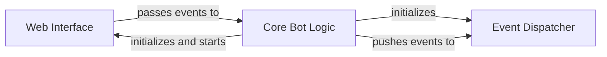

## Details

One paragraph explaining the functionality which is represented by this graph. What the main flow is and what is its purpose.

### Web Interface [[Expand]](./Web_Interface.md)

Provides an HTTP interface for external interactions, primarily used for handling incoming webhook commands and potentially serving a bot status page. It uses Flask to create a web server that listens for requests, allowing the bot to receive commands and events from platforms like Slack.

**Related Classes/Methods**:

- <a href="https://github.com/pinterest/slackminion/blob/master/slackminion/webserver.py#L9-L55" target="_blank" rel="noopener noreferrer">`slackminion.webserver.Webserver` (9:55)</a>

### Core Bot Logic

This is the central orchestrator of the bot. It's responsible for the overall lifecycle, including initializing and managing the Web Interface and Event Dispatcher. It acts as the brain that coordinates all other components, making it indispensable for the bot's operation. It also pushes events to the Event Dispatcher for processing.

**Related Classes/Methods**:

- <a href="https://github.com/pinterest/slackminion/blob/master/slackminion/bot.py#L23-L400" target="_blank" rel="noopener noreferrer">`slackminion.bot.Bot` (23:400)</a>

### Event Dispatcher

This component is vital for the bot's responsiveness and extensibility. It takes raw events received by the Core Bot Logic and intelligently routes them to the appropriate handlers (e.g., plugins, commands). This separation of concerns allows for a modular design where new functionalities can be added as plugins without modifying the core event processing logic.

**Related Classes/Methods**:

- <a href="https://github.com/pinterest/slackminion/blob/master/slackminion/dispatcher.py#L61-L232" target="_blank" rel="noopener noreferrer">`slackminion.dispatcher.MessageDispatcher` (61:232)</a>

### [FAQ](https://github.com/CodeBoarding/GeneratedOnBoardings/tree/main?tab=readme-ov-file#faq)