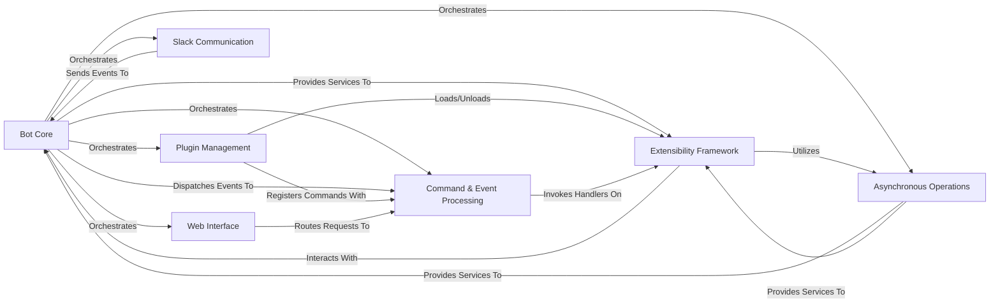

## Details

The `slackminion` project is a modular and extensible bot framework designed for Slack. It operates by establishing a real-time connection with Slack to receive events and messages. A central `Bot Core` orchestrates all operations, including managing plugins, dispatching commands, and handling asynchronous tasks. Incoming events and webhook requests are processed by the `Command & Event Processing` component, which identifies and routes commands to the appropriate handlers within loaded plugins. The `Plugin Management` system allows for dynamic loading and unloading of functionalities, which are built upon the `Extensibility Framework`. This architecture ensures a clear separation of concerns, enabling developers to easily extend the bot's capabilities through custom plugins while maintaining a robust and responsive core.

### Bot Core [[Expand]](./Bot_Core.md)

The central orchestrator of the bot. It initializes, manages the lifecycle of, and coordinates all other major components. It processes raw Slack events and prepares output messages.

**Related Classes/Methods**:

- <a href="https://github.com/pinterest/slackminion/blob/master/slackminion/bot.py#L23-L400" target="_blank" rel="noopener noreferrer">`slackminion.bot.Bot` (23:400)</a>

- <a href="https://github.com/pinterest/slackminion/blob/master/slackminion/__main__.py#L11-L76" target="_blank" rel="noopener noreferrer">`slackminion.__main__.main` (11:76)</a>

### Plugin Management [[Expand]](./Plugin_Management.md)

Discovers, loads, unloads, and manages the lifecycle of all bot plugins. It ensures plugins are properly initialized and their commands are registered.

**Related Classes/Methods**:

- <a href="https://github.com/pinterest/slackminion/blob/master/slackminion/plugin/manager.py#L12-L164" target="_blank" rel="noopener noreferrer">`slackminion.plugin.manager.PluginManager` (12:164)</a>

### Command & Event Processing

Parses incoming messages and webhook requests to identify commands. It then routes these commands to the appropriate handlers within the loaded plugins.

**Related Classes/Methods**:

- <a href="https://github.com/pinterest/slackminion/blob/master/slackminion/dispatcher.py#L61-L232" target="_blank" rel="noopener noreferrer">`slackminion.dispatcher.MessageDispatcher` (61:232)</a>

- <a href="https://github.com/pinterest/slackminion/blob/master/slackminion/dispatcher.py#L11-L30" target="_blank" rel="noopener noreferrer">`slackminion.dispatcher.BaseCommand` (11:30)</a>

- <a href="https://github.com/pinterest/slackminion/blob/master/slackminion/dispatcher.py#L33-L41" target="_blank" rel="noopener noreferrer">`slackminion.dispatcher.PluginCommand` (33:41)</a>

- <a href="https://github.com/pinterest/slackminion/blob/master/slackminion/dispatcher.py#L44-L58" target="_blank" rel="noopener noreferrer">`slackminion.dispatcher.WebhookCommand` (44:58)</a>

### Slack Communication [[Expand]](./Slack_Communication.md)

Manages the Real-Time Messaging (RTM) connection with Slack. It is responsible for establishing and maintaining the WebSocket connection, receiving real-time events from Slack, and sending messages back. It also includes data models for Slack entities.

**Related Classes/Methods**:

- <a href="https://github.com/pinterest/slackminion/blob/master/slackminion/slack/rtm_client.py#L3-L11" target="_blank" rel="noopener noreferrer">`slackminion.slack.rtm_client.MyRTMClient` (3:11)</a>

- <a href="https://github.com/pinterest/slackminion/blob/master/slackminion/slack/conversation.py#L3-L73" target="_blank" rel="noopener noreferrer">`slackminion.slack.conversation.SlackConversation` (3:73)</a>

- <a href="https://github.com/pinterest/slackminion/blob/master/slackminion/slack/user.py#L3-L77" target="_blank" rel="noopener noreferrer">`slackminion.slack.user.SlackUser` (3:77)</a>

- <a href="https://github.com/pinterest/slackminion/blob/master/slackminion/slack/event.py#L1-L1" target="_blank" rel="noopener noreferrer">`slackminion.slack.event.SlackEvent` (1:1)</a>

### Web Interface [[Expand]](./Web_Interface.md)

Provides an HTTP interface for external interactions, primarily used for handling incoming webhook commands and potentially serving a bot status page.

**Related Classes/Methods**:

- <a href="https://github.com/pinterest/slackminion/blob/master/slackminion/webserver.py#L9-L55" target="_blank" rel="noopener noreferrer">`slackminion.webserver.Webserver` (9:55)</a>

### Asynchronous Operations [[Expand]](./Asynchronous_Operations.md)

Manages and schedules asynchronous operations, including periodic tasks and delayed calls, to ensure the bot's non-blocking execution and responsiveness.

**Related Classes/Methods**:

- <a href="https://github.com/pinterest/slackminion/blob/master/slackminion/utils/async_task.py#L70-L232" target="_blank" rel="noopener noreferrer">`slackminion.utils.async_task.AsyncTaskManager` (70:232)</a>

- <a href="https://github.com/pinterest/slackminion/blob/master/slackminion/utils/async_task.py#L41-L67" target="_blank" rel="noopener noreferrer">`slackminion.utils.async_task.AsyncTimer` (41:67)</a>

- <a href="https://github.com/pinterest/slackminion/blob/master/slackminion/utils/async_task.py#L9-L38" target="_blank" rel="noopener noreferrer">`slackminion.utils.async_task.CallLater` (9:38)</a>

### Extensibility Framework [[Expand]](./Extensibility_Framework.md)

Defines the abstract interface and common functionalities that all concrete plugins must implement or inherit. It also encompasses core, built-in plugins providing fundamental bot functionalities like ACLs, basic commands, and user management.

**Related Classes/Methods**:

- <a href="https://github.com/pinterest/slackminion/blob/master/slackminion/plugin/base.py#L11-L189" target="_blank" rel="noopener noreferrer">`slackminion.plugin.base.BasePlugin` (11:189)</a>

- <a href="https://github.com/pinterest/slackminion/blob/master/slackminion/plugins/core/acl.py#L33-L209" target="_blank" rel="noopener noreferrer">`slackminion.plugins.core.acl.AuthManager` (33:209)</a>

- <a href="https://github.com/pinterest/slackminion/blob/master/slackminion/plugins/core/core.py#L15-L150" target="_blank" rel="noopener noreferrer">`slackminion.plugins.core.core.Core` (15:150)</a>

- <a href="https://github.com/pinterest/slackminion/blob/master/slackminion/plugins/core/user.py#L8-L65" target="_blank" rel="noopener noreferrer">`slackminion.plugins.core.user.UserManager` (8:65)</a>

### [FAQ](https://github.com/CodeBoarding/GeneratedOnBoardings/tree/main?tab=readme-ov-file#faq)